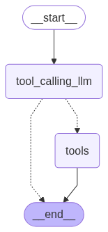
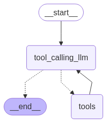

# ai-app-2

AI application using langchain, langgraph and langsmith framework/tool - building medium to advanced level AI application

## setup UP python package manager (similar to npm in javascript)

1. install uv in your maching -
   pip install uv

2. create virtual env -
   uv venv my-env-name

3. Activate your virtual env
   e.g., source my-env-name/bin/activate

4. Add requirements.txt file - and mention required components/libraries

---

5. install all libraries/components -
   uv add -r requirements.txt

#### you can see the installed packages/libraries inside pyproject.toml . like -

[project]
name = "ai-app-2"
version = "0.1.0"
description = "Add your description here"
readme = "README.md"
requires-python = ">=3.13"
dependencies = [
"langchain>=0.3.25",
"langgraph>=0.4.8",
"langsmith>=0.3.45",
]

---

6. install -
   uv add ipykernel

# Langgraph

Langgraph can be used in two main ways:

1. **Graph API**: Provides an interface for working with graphs programmatically.
2. **Functional API**: Offers a set of functions for performing graph-related operations.

## Login to groq cloud and get your model api key

`https://console.groq.com/playground?model=llama3-8b-8192` and put the api key in .env

## Tavily - web search tool

get TAVILY_API_KEY and put it in .env

# AI Agent using Langgraph

Langgraph enables the creation of AI agents by providing tools for graph-based reasoning and decision-making.



# ReAct Agent Architecture using Langgraph

The ReAct agent combines reasoning and acting capabilities, leveraging Langgraph to structure interactions and make informed decisions.



---

# Chatbot with Memory

This chatbot is designed to remember previous conversations within a chat thread or configuration, enabling more context-aware interactions.


---

# Streaming Modes in LangGraph

A quick reference to LangGraph’s streaming modes, what streaming is, and how to use each mode.

---

## What is Streaming?

Streaming in LangGraph lets you **receive intermediate outputs** from your graph as it executes, without waiting for the full run to complete. This enables real-time UIs, debugging, and incremental processing.

---

## Why Use Streaming?

Streaming offers several advantages:

- **Lower latency**: Begin processing or displaying partial results immediately.
- **Improved UX**: Give users real‑time feedback (e.g., typing indicator, live data updates).
- **Debuggability**: Inspect intermediate states to trace and diagnose issues.
- **Resource efficiency**: Stop early if a desired result appears before full execution.

---

### Methods: .stream() and astream()

1. These methods are sync and async methods for streaming back results.
2. Additional parameters in streaming modes for graph state

#### values : This streams the full state of the graph after each node is called.

#### updates : This streams updates to the state of the graph after each node is called.

## Stream Modes

- **values**
  Emits the **full graph state** dict after each node runs.

- **updates**
  Emits only the **changed keys/values** (deltas) after each node runs.

- **tokens**
  Emits each **token** or chunk from streaming‐enabled LLM nodes as they arrive.

---

## How to Use

1. **Prepare state & config** (e.g., thread ID):

   ```python
   state  = {"messages": []}
   config = {"configurable": {"thread_id": "3"}}
   ```

2. **Choose your mode**: `"values"`, `"updates"`, or `"tokens"`.

3. **Stream and consume**:

   ```python
   for chunk in graph.stream(state, config, stream_mode="<MODE>"):
       print(chunk)
   ```

- Use **values** when you need complete snapshots at each step.
- Use **updates** for lightweight, incremental diffs to apply yourself.
- Use **tokens** to build low‐latency, token‐by‐token UIs with streaming LLMs.

---

## Examples

### 1. values

```python
# full state each step
# node1 appends "Hello" → {'messages': ['Hello']}
# node2 appends "World" → {'messages': ['Hello', 'World']}
```

### 2. updates

```python
# only diffs each step
# node1 → {'messages': ['Hello']}
# node2 → {'messages': ['World']}
```

### 3. tokens

```python
# streaming LLM tokens
# yields {'token': 'H', 'node': 'greet'} → ... → 'Hello'
```

---

Choose the mode that aligns with your needs:

- **values** for simple, complete snapshots
- **updates** for efficient incremental updates
- **tokens** for immediate token‐level streaming

---

# Human Feedback in the loop / Human in the loop :

### Human-in-the-Loop is a design pattern in AI workflows where humans are actively involved at certain stages of a process — typically to:

1. Review or approve intermediate results

2. Correct errors

3. Guide decisions

4. Choose between multiple options

In LangGraph, this becomes especially powerful when combined with streaming, because you can pause at intermediate steps, wait for human feedback, and then continue execution.

Example pseudocode:

```bash
for update in graph.stream(input, stream_mode='updates'):
    display(update)

    if needs_human_approval(update):
        feedback = wait_for_user_input()
        update.update(feedback)
```

---
